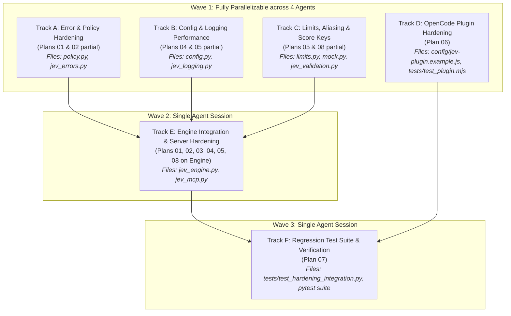

# Jev-TypeSafe MCP — Hardening & Performance Plan Master Orchestrator

> **Status**: Ready for execution across autonomous agent sessions.  
> **Target System**: `jev-typesafe-mcp` (MCP Server, Python Core Engine, OpenCode Plugin, Test Suite).  
> **Base Health**: 137 tests passing.  
> **Goal**: Eliminate 5 correctness bugs, resolve 7 reliability risks, apply 6 performance optimizations, and harden 5 OpenCode plugin loopholes.

---

## 🚀 Parallel vs. Sequential Execution Strategy

You can execute these plans in **parallel agent chats** or **sequentially in a single agent chat**.

### ⚠️ The File Collision Rule
Multiple agents running in parallel **MUST NOT** edit the same file simultaneously. Doing so produces merge conflicts, broken imports, and shifting line numbers.

To enable parallel execution, this plan is divided into **Waves** based on file-system independence:

---

## 📊 File Conflict & Ownership Matrix

| File Path | Owning Phase / Track | Can Edit in Parallel With |
|-----------|----------------------|---------------------------|
| `policy.py` | Track A (`02_fix_remaining_correctness_bugs.md`) | Tracks B, C, D |
| `jev_errors.py` | Track A (`01_fix_error_ordering_and_add_retries.md`) | Tracks B, C, D |
| `config.py` | Track B (`04_client_caching_and_settings_fix.md`) | Tracks A, C, D |
| `jev_logging.py` | Track B (`05_performance_improvements.md`) | Tracks A, C, D |
| `limits.py` | Track C (`05_performance_improvements.md`, `08_low_priority_cleanup.md`) | Tracks A, B, D |
| `mock.py` | Track C (`08_low_priority_cleanup.md`) | Tracks A, B, D |
| `jev_validation.py` | Track C (`08_low_priority_cleanup.md`) | Tracks A, B, D |
| `config/jev-plugin.example.js` | Track D (`06_plugin_hardening_security.md`) | Tracks A, B, C, E |
| `jev_engine.py` | Track E (`01`, `02`, `03`, `04`, `05`, `08` Engine sections) | Track D only |
| `jev_mcp.py` | Track E (`08_low_priority_cleanup.md`) | Track D only |
| `tests/test_hardening_integration.py`| Track F (`07_test_suite_and_verification.md`) | None (Run after all) |

---

## 🗂️ Complete Plans Directory

| Plan File | Title | Primary Files | Parallel Track |
|---|---|---|---|
| [`01_fix_error_ordering_and_add_retries.md`](file:///d:/mcp/jev-typesafe-mcp/.agents_plans/01_fix_error_ordering_and_add_retries.md) | Exception hierarchy ordering, non-skippable tests, client retry policy | `jev_errors.py`, `jev_engine.py`, `tests/test_errors.py` | Track A & E |
| [`02_fix_remaining_correctness_bugs.md`](file:///d:/mcp/jev-typesafe-mcp/.agents_plans/02_fix_remaining_correctness_bugs.md) | Unify risk thresholds, fix greedy family-prefix, client lock thread safety | `policy.py`, `jev_engine.py`, `tests/test_policy.py` | Track A & E |
| [`03_add_input_guardrails_security.md`](file:///d:/mcp/jev-typesafe-mcp/.agents_plans/03_add_input_guardrails_security.md) | Windows root blocking, depth-limited file scan, input length bounds | `jev_engine.py`, `tests/test_mock_tools.py` | Track E |
| [`04_client_caching_and_settings_fix.md`](file:///d:/mcp/jev-typesafe-mcp/.agents_plans/04_client_caching_and_settings_fix.md) | Structured settings error log, mtime settings cache, config cache | `config.py`, `jev_engine.py`, `tests/test_mock_tools.py` | Track B & E |
| [`05_performance_improvements.md`](file:///d:/mcp/jev-typesafe-mcp/.agents_plans/05_performance_improvements.md) | Single json.dumps in logging, token pre-fit reuse, redundant git walk removal | `jev_logging.py`, `limits.py`, `jev_engine.py` | Track B, C & E |
| [`06_plugin_hardening_security.md`](file:///d:/mcp/jev-typesafe-mcp/.agents_plans/06_plugin_hardening_security.md) | Child process leak fix, prompt length guard, log rotation, bare model ID | `config/jev-plugin.example.js`, `tests/test_plugin.mjs` | Track D |
| [`07_test_suite_and_verification.md`](file:///d:/mcp/jev-typesafe-mcp/.agents_plans/07_test_suite_and_verification.md) | 10 new regression tests, concurrency test, full verification run | `tests/test_hardening_integration.py` | Track F |
| [`08_low_priority_cleanup.md`](file:///d:/mcp/jev-typesafe-mcp/.agents_plans/08_low_priority_cleanup.md) | Top-level math imports, defensive state copying, score keys int normalization, atexit | `limits.py`, `mock.py`, `jev_validation.py`, `jev_mcp.py` | Track C & E |

---

## 🛠️ How to Prompt Agents for Execution

### Option 1: Parallel Execution (Fastest - 4 Agents in Parallel, then 1, then 1)

1. **Agent 1 (Track A)**:  
   > "Execute the changes for Track A (Errors and Policy) defined in `.agents_plans/01_fix_error_ordering_and_add_retries.md` and `.agents_plans/02_fix_remaining_correctness_bugs.md`. Restrict your file edits strictly to `jev_errors.py`, `policy.py`, `tests/test_errors.py`, and `tests/test_policy.py`. Do NOT touch `jev_engine.py`."

2. **Agent 2 (Track B)**:  
   > "Execute the changes for Track B (Config and Logging) defined in `.agents_plans/04_client_caching_and_settings_fix.md` and `.agents_plans/05_performance_improvements.md`. Restrict your file edits strictly to `config.py` and `jev_logging.py`. Do NOT touch `jev_engine.py`."

3. **Agent 3 (Track C)**:  
   > "Execute the changes for Track C (Limits, Aliasing and Score Keys) defined in `.agents_plans/05_performance_improvements.md` and `.agents_plans/08_low_priority_cleanup.md`. Restrict your file edits strictly to `limits.py`, `mock.py`, and `jev_validation.py`. Do NOT touch `jev_engine.py`."

4. **Agent 4 (Track D - OpenCode Plugin)**:  
   > "Execute the changes for Track D defined in `.agents_plans/06_plugin_hardening_security.md`. Restrict your file edits strictly to `config/jev-plugin.example.js` and `tests/test_plugin.mjs`. Run `node tests/test_plugin.mjs` to verify."

5. **After Tracks A, B, C finish -> Agent 5 (Track E - Core Engine Integration)**:  
   > "Execute all `jev_engine.py` and `jev_mcp.py` changes from plans 01, 02, 03, 04, 05, and 08. Since Tracks A, B, and C have already updated `policy.py`, `config.py`, and `limits.py`, integrate and verify against those modules. Run `pytest tests/` to confirm."

6. **Agent 6 (Track F - Final Suite & Verification)**:  
   > "Execute `.agents_plans/07_test_suite_and_verification.md`. Create `tests/test_hardening_integration.py`, add the 10 test cases, and execute the full test suite."

---

### Option 2: Sequential Execution (Single Chat)
Run the plans one by one in numerical order:
`01` ➔ `02` ➔ `03` ➔ `04` ➔ `05` ➔ `06` ➔ `08` ➔ `07`.
Run `pytest tests/ -v` after each phase.
